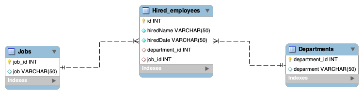
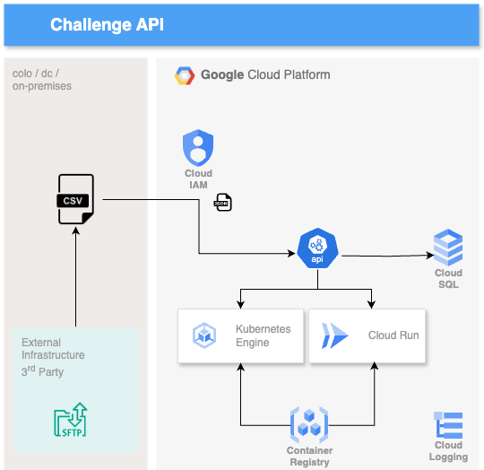

# Challenge Globant Data Engineer

Proyecto Java con framework SpringBoot, arquetipo por defecto vacío y además con Maven incluído para manejo de dependencias.

La ejecución es mediante comando de instalación Maven y posterior ejecución en local

``` sh
mvn clean install
```

Una vez generado el .JAR se procede a ejecutar instalador de imagen Docker

``` sh
installerDocker.sh
```

También se agregó un instalador pero hacia Cloud Source Repositories de Google Cloud

``` sh
installerCloud.sh
```

Nota: Para ejecutar este shell script es necesario tener autenticación hacia el cloud con una cuenta y además roles asignados.

## Modelo BDDD

Se tomó como referencia el siguiente modelo de base de datos, de 3 tablas en motor MySQL (localhost)



Nota: Los scripts de creación están en scripts.sql

&nbsp;

## Arquitectura de referencia

La arquitectura de referencia si llevamos el proyecto a la nube GCP




## Dependencias

opencsv
springframeworkboot
mysqlconnector for java

